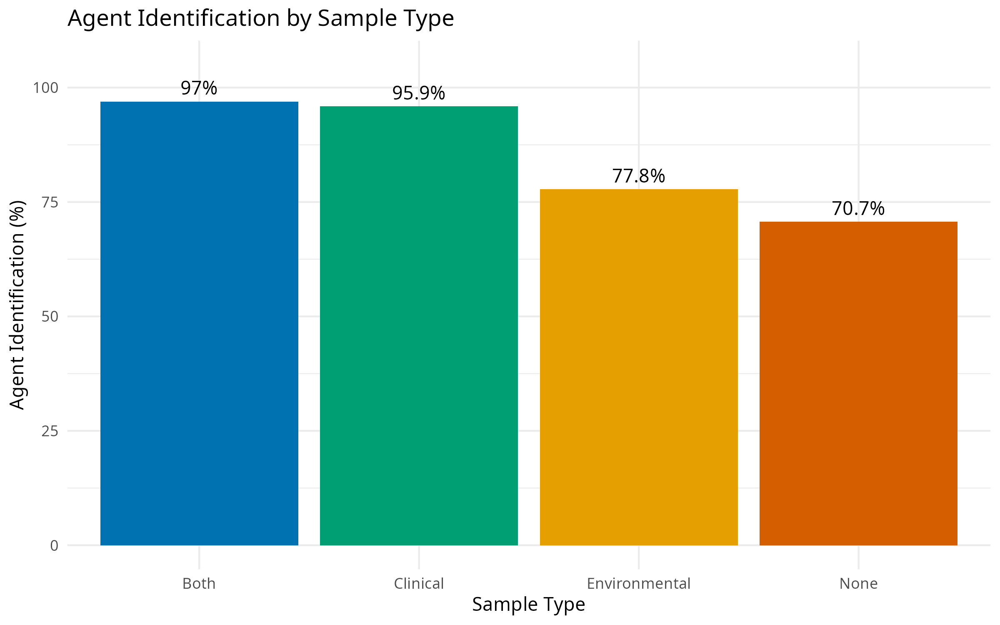
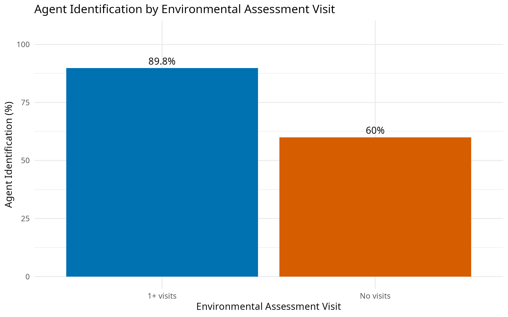

# Foodborne Outbreak Investigation Analysis

## Research Question
Which investigation characteristics are associated with successful identification of the etiologic agent in foodborne outbreak investigations?
## Dataset
CDC National Environmental Assessment Reporting System (NEARS), 2014-2016.
## Project Goal
This project examines whether investigation characteristics such as sample type, epidemiologic investigation method, and environmental assessment visits are associated with successful identification of the etiologic agent.
## Data Cleaning and Validation
- Checked missing values
- Checked for duplicate rows
- Preserved an untouched raw copy of the dataset
- Standardized column names
- Recoded investigation outcomes into Yes/No categories
- Recoded timing variables based on their coded categories
- Reviewed small cell sizes before choosing statistical tests
## Analysis
The primary outcome for this project was successful identification of the etiologic agent associated with a foodborne outbreak investigation.
The analysis initially considered three investigation outcomes available in the dataset: food identification, contributing-factor identification, and agent identification. After exploratory analysis, agent identification was selected as the primary outcome because it showed the clearest and most consistent variation across investigation characteristics. This narrowing step helped keep the final analysis focused on a single, interpretable outcome rather than treating all available variables as equally important.

Three investigation characteristics were prioritized for the final analysis:
- Sample type
- Epidemiologic investigation method
- Whether at least one environmental assessment visit occurred

These were selected because they represent distinct components of outbreak investigation practice: laboratory sampling, epidemiologic investigation strategy, and environmental assessment activity.

### Statistical Approach

For each investigation characteristic, I first examined raw counts and row percentages to compare the proportion of investigations in which the etiologic agent was successfully identified.

Associations between categorical investigation characteristics and agent identification were then evaluated using chi-square tests of independence when appropriate. When expected cell counts were small and the chi-square approximation was questionable, Fisher's exact test was used instead in these scenarios.

Statistical significance was evaluated using an alpha level of 0.05. Because this analysis is observational, statistically significant findings were interpreted as associations rather than evidence of causal effects.

### Sample Type and Agent Identification
Agent identification varied substantially across sample-type categories.
- Both clinical and environmental samples: 97.0% agent identification
- Clinical samples only: 95.9%
- Environmental samples only: 77.8%
- No samples collected: 70.7%
The chi-square test generated a warning indicating that some expected cell counts were small. Because this violated an assumption of the chi-square approximation, Fisher's exact test was used as the more appropriate inferential test.
Fisher's exact test demonstrated a statistically significant association between sample type and successful agent identification (p < 0.001).

The descriptive pattern suggests that investigations involving clinical specimens, either alone or in combination with environmental specimens, were substantially more likely to identify the etiologic agent than investigations in which no specimens were collected.

### Epidemiologic Investigation Method and Agent Identification

Agent identification also differed according to the epidemiologic investigation method used.

- Case-control investigations: 90.4% agent identification
- Interview-based investigations: 84.2%
- Cohort investigations: 77.8%
- No epidemiologic investigation method: 41.7%

As with sample type, the chi-square analysis produced a warning related to small expected cell counts. Fisher's exact test was therefore used for the final inference.
The association between epidemiologic investigation method and agent identification was statistically significant (p < 0.001).

The most notable contrast was between investigations that used a defined epidemiologic method and those that did not. Investigations without a documented epidemiologic investigation method had substantially lower agent-identification success than investigations using case-control, cohort, or interview-based approaches.

However, these findings do not establish that one epidemiologic design directly causes greater agent-identification success. The choice of investigation method may depend on outbreak size, setting, available cases, jurisdictional capacity, and the stage at which the outbreak was detected.

### Environmental Assessment Visits and Agent Identification
Environmental assessment activity showed one of the clearest differences in the analysis.
When the original number of environmental assessment visits was examined, agent identification increased from 60.0% among investigations with no environmental assessment visit to 88.5% with one visit, 92.7% with two visits, and 100% among investigations with three or four visits.
However, the three- and four-visit categories contained very small numbers of investigations, making those 100% estimates unstable and potentially misleading.

To improve interpretability and avoid emphasizing sparse categories, the variable was collapsed into:
- No environmental assessment visits
- One or more environmental assessment visits
Using this classification:
- Investigations with at least one environmental assessment visit identified the agent in 89.8% of cases.
- Investigations with no environmental assessment visit identified the agent in 60.0% of cases.

A chi-square test of independence showed a statistically significant association between environmental assessment visits and agent identification, χ²(1) = 33.65, p < 0.001.

This was one of the strongest descriptive differences observed in the project.
From an operational perspective, the result suggests that investigations involving environmental assessment activity were more likely to achieve successful agent identification. 

However, this finding may also reflect differences in investigation intensity, staffing, outbreak complexity, or jurisdictional resources. Therefore, environmental assessment visits should be interpreted as a marker associated with more successful investigations rather than as proof that conducting a visit directly causes agent identification.

### Overall Interpretation

Across all three investigation characteristics, successful agent identification was more common in investigations that included more complete investigative activity.
Higher agent-identification percentages were observed when:
- clinical or combined clinical/environmental specimens were collected,
- a defined epidemiologic investigation method was used, and
- at least one environmental assessment visit occurred.

Taken together, these findings suggest that agent identification is associated with the breadth and intensity of outbreak investigation activities.
The results are consistent with the idea that successful foodborne outbreak investigations often depend on multiple complementary components, including laboratory evidence, epidemiologic investigation, and environmental assessment.

## Key Findings
- Agent identification was highest when clinical specimens were collected. Investigations using both clinical and environmental samples identified the etiologic agent in 97.0% of cases, while investigations with no samples identified the agent in 70.7% of cases.
- Epidemiologic investigation method was significantly associated with agent identification. Case-control investigations had the highest identification percentage at 90.4%, while investigations with no documented epidemiologic investigation method had the lowest at 41.7%.
- Environmental assessment activity showed one of the largest observed differences. Investigations with at least one environmental assessment visit identified the agent in 89.8% of cases compared with 60.0% of investigations with no environmental assessment visit.
- All three primary investigation characteristics were significantly associated with agent identification. These findings suggest that successful agent identification may depend on multiple complementary components of outbreak investigation rather than any single activity alone.
## Decision Log
- I narrowed the analysis from three possible outcomes to agent identification because it showed the clearest and most consistent patterns.
- I recoded timing variables after discovering that values 1, 2, and 3 represented categories rather than literal numbers of days.
- I used Fisher's exact test when chi-square assumptions were not met because of small expected cell counts.
- I grouped environmental assessment visits into 0 versus 1+ visits because the 3- and 4-visit groups were too small to interpret confidently.
## Limitations
This analysis is observational, so the findings show associations rather than causation. Some categories had small sample sizes, and the analysis did not adjust for potential confounding factors such as outbreak size, jurisdictional resources, or investigation complexity. Data were reported by 16 participating state and local U.S. health departments and represent foodborne illness outbreaks investigated in retail food establishments from 2014–2016.
## Public Health Significance
Successful agent identification was associated with specimen collection, epidemiologic investigation methods, and environmental assessment activity. These findings suggest that coordinated investigation practices may improve the likelihood of identifying the cause of a foodborne outbreak.
## Visualizations
### Agent Identification by Sample Type

### Agent Identification by Environmental Assessment Visit

 
## Next Steps
Future analysis could examine whether these associations remain after accounting for outbreak characteristics, investigation setting, and jurisdictional capacity. Additional analyses could also evaluate whether combinations of investigation activities are associated with higher probabilities of etiologic agent identification.
